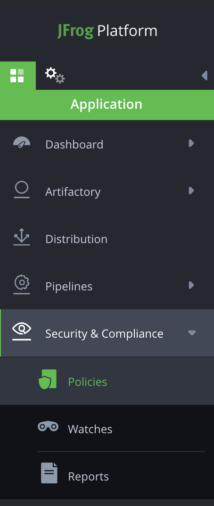
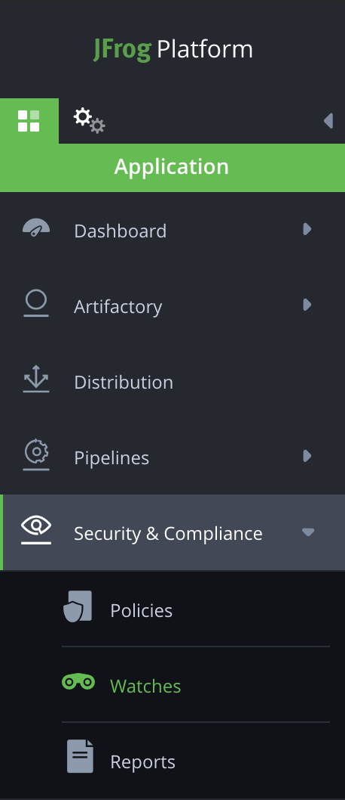

# JFrog Platform Vulnerability Notification Demo

## Purpose
Utilize JFrog Artifactory + Xray and Partner integrations (Slack, Pagerduty, Datadog, Jiracloud) to create a robust end to end Security information event management pipeline to monitor your artifacts through JFrog's platform.

## Artifactory Setup
Artifactory is required and we recommend following the below best practices highlighted in this demo:

```text
1. Separation of dev/test/prod artifact repos
2. Usage of build info and build promotion in Artifactory
3. Artifact property usage for labels/tags on artifacts
```

Artifact repos by type must be properly separated by dev/test/prod to enable our demo flow to monitor impacted environment types for an infected component.

## Xray Setup

To setup Xray, we will create a new Policy with a rule to generate violations and associate it to an Xray Watch following the steps below:

1. Navigate to **Security and Compliance** in JFrog Platform’s **Application** section and select **Policies**

2. Next, specify the **policy name** and select **security** from the dropdown list below policy name

3. Next, create a **new rule** for the policy by clicking on the **New Rule** to the right

4. Enter a **rule name**
5. In the **criteria** section, select the **minimal severity** or the **cvss score**. Violations in Xray are filtered based on this criteria and sent to pagerduty
6. In the **Automatic Actions** section, select **Trigger Webhook** checkbox and select the webhook that you created above for pagerduty
7. Click on **Save**

8. A policy rule is created with the rule name specified in Step 4
9. Click **create** to create a policy with name specified in Step 4
10. Navigate to **watches** in the **Security and Compliance** section on the left

11. Create a **new watch** or edit an existing watch
12. In order to create a new watch, click on the **New Watch** present at the top right corner of the screen
13. Enter the **name** and description of the watch
14. In **Manage Resources** section, click on **Add repositories** or **Add Builds** or **Add Bundles** and then include the resource that you want to watch from the available resources and click **Save**
15. In the **Assigned policies** section, Click on **Manage policies** towards the right and include the policy created in Step 7 and click **Save**
16. Click **Save** to save the watch
17. You’ll see the watch in the list of watches

Once the Xray Policy & Watch has been created we can proceed with our partner integrations setup guides below.

## Xray Slack App Setup

Follow our integration guide to setup [Xray Slack App here.](../../../Slack/Platform/App/README.md)

## Xray Pagerduty App Setup

Follow our integration guide to setup [Xray Pagerduty App here.](../../../PagerDuty/Xray/SecurityIncidents/README.md)

## Xray Datadog SIEM Setup

Follow our integration guide to setup [Xray Datadog SIEM here.](https://github.com/jfrog/log-analytics/tree/master/fluentd/plugins/input/fluent-plugin-jfrog-siem#setup--configuration)

## Pagerduty Jiracloud App Setup

We used the Jiracloud App for Pagerduty to generate our Jira issue directly from Pagerduty. Additional information on this app can be found [here.](https://support.pagerduty.com/docs/jira-cloud)

## Putting it all together

Now that we have everything setup when a new Xray vulnerability is found in our production docker repo we will be notified in Slack with the information we need to quickly leverage the Datadog Xray Violation Dashboard to assess, analyze, and mitigate future security risks.

Setup as many Xray watches as needed to monitor environments utilizing Datadog and Pagerduty to assess, monitor, and notify the proper team or on-call staff.

